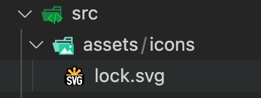

# 项目插件

- 安装 UI 组件库：element-plus
- 设置环境变量和路径别名
- 配置 SVG 图标：vite-plugin-svg-icons
- 集成 SASS
- 模拟 API：mock.js
- 请求封装：axios
- 路由组件：vue-router
- 集中式状态管理：pinia

## element-plus

官方文档：[element-plus](https://element-plus.gitee.io/zh-CN/)

安装：

```shell
pnpm install element-plus @element-plus/icons-vue
```

在`src/main.ts`中全局安装 element-plus 插件和导入 element-plus 的样式，并将其默认语言改为中文（默认为英文）：

```javascript
import { createApp } from 'vue'
import './style.css'
import App from './App.vue'
import ElementPlus from 'element-plus'
// 引入 Element Plus 默认样式文件
import 'element-plus/theme-chalk/index.css'
import zhCn from 'element-plus/lib/locale/lang/zh-cn'

const app = createApp(App)
// 修改默认语言为中文
app.use(ElementPlus, {
  locale: zhCn,
})

app.mount('#app')
```

在`tsconfig.json`中对 Element Plus 全局组件类型声明:

```javascript
// tsconfig.json
{
  "compilerOptions": {
    // ...
  "types": ["element-plus/global.d.ts"]
  }
}
```

## 配置路径别名

在`vite.config.ts`中给`src`文件配置路径别名`@`:

```javascript
import { defineConfig } from 'vite'
import vue from '@vitejs/plugin-vue'
import path from 'path'
export default defineConfig({
  plugins: [vue()],
  resolve: {
    alias: {
      '@': path.resolve('./src'), // 相对路径别名配置，使用 @ 代替 src
    },
  },
})
```

在`tsconfig.json`对路径映射的 typescript 编译配置：

```javascript
// tsconfig.json
{
  "compilerOptions": {
    "baseUrl": "./", // 解析非相对模块的基地址，默认是当前目录
    "paths": { //路径映射，相对于baseUrl
      "@/*": ["src/*"]
    }
  }
}
```

## 环境变量配置

在不同的环境（开发环境、测试环境、生产环境）中，配置不同的环境变量，在项目根目录分别添加开发、生产和测试环境的文件:

```text
.env.development
.env.production
.env.test
```

变量必须以 VITE\_ 为前缀才能暴露给外部读取，分别编写文件内容。

.env.development：

```
NODE_ENV = 'development'
VITE_APP_TITLE = 'hand-vue-admin-dev'
VITE_APP_BASE_API = '/dev-api'
```

.env.production:

```text
NODE_ENV = 'production'
VITE_APP_TITLE = 'hand-vue-admin-prod'
VITE_APP_BASE_API = '/prod-api'
```

.env.test

```text
NODE_ENV = 'test'
VITE_APP_TITLE = 'hand-vue-admin-test'
VITE_APP_BASE_API = '/test-api'
```

## SVG 图标配置

SVG 相比于图片，可以缩小文件体积和提高文件性能。

安装 svg 依赖插件：

```shell
pnpm install vite-plugin-svg-icons -D
```

在`vite.config.ts`中配置插件：

```javascript
import { createSvgIconsPlugin } from 'vite-plugin-svg-icons'
import path from 'path'
export default () => {
  return {
    plugins: [
      createSvgIconsPlugin({
        // Specify the icon folder to be cached
        iconDirs: [path.resolve(process.cwd(), 'src/assets/icons')],
        // Specify symbolId format
        symbolId: 'icon-[dir]-[name]',
      }),
    ],
  }
}
```

在`main.ts`中导入：

```javascript
import 'virtual:svg-icons-register'
```

案例如下，其中`xlink:href="#icon-"`的`#icon-`后面跟着的是在`iconDirs`中指定的文件夹下去除 svg 后缀的文件名：

```javascript
 <!-- 测试svg图片 -->
  <svg :style="{ width: '190px', height: '190px' }">
    <use xlink:href="#icon-lock" fill="#bfa"></use>
  </svg>
```



封装 svg 组件，在`src/components`下创建`SvgIcon/index.vue`：

```javascript
<template>
  <div>
    <svg :style="{ width: width, height: height }">
      <use :xlink:href="prefix + name" :fill="color"></use>
    </svg>
  </div>
</template>

<script setup lang="ts">
defineProps({
  //xlink:href属性值的前缀
  prefix: {
    type: String,
    default: '#icon-',
  },
  //svg矢量图的名字
  name: String,
  //svg图标的颜色
  color: {
    type: String,
    default: '',
  },
  //svg宽度
  width: {
    type: String,
    default: '16px',
  },
  //svg高度
  height: {
    type: String,
    default: '16px',
  },
})
</script>
```

封装为全局组件，首先在`components`文件夹下，创建`index.ts`文件，并添加如下内容，实现注册全局组件的插件：

```javascript
import SvgIcon from '@/components/SvgIcon/index.vue'
import type { App, Component } from 'vue'

const components: { [name: string]: Component } = { SvgIcon }

export default {
  install(app: App) {
    Object.keys(components).forEach((key: string) => {
      // 用于注册components文件夹内部全部全局组件
      app.component(key, components[key])
    })
  },
}
```

在`main.ts`中安装该插件：

```javascript
import gloablComponent from '@/components'
app.use(gloablComponent)
```

## SASS

在配置 styleLint 工具的时候，项目当中已经安装过`sass sass-loader`，因此可以在组件内使用`scss`语法，但需要在 style 标签中加上`lang=scss`的属性:

```javascript
<style scoped lang="scss"></style>
```

在`src/style`文件夹下，添加清除浏览器默认样式的`reset.scss`文件，[内容参考](https://www.npmjs.com/package/reset.scss?activeTab=code)，或者使用[插件的形式](https://www.npmjs.com/package/scss-reset)

在`src/style`文件夹下，创建`index.scss`用于全局样式文件的入口，并再次文件中引用`reset.scss`文件：

```scss
@import 'reset.scss';
```

在`main.ts`中，导入`index.scss`:

```javascript
import '@/styles/index.scss'
```

在 src/styles/index.scss 全局样式文件中没有办法使用$变量，需要给项目中引入全局变量$，在`src/styles`文件夹下，创建一个`variable.scss`文件，同时编辑`vite.config.ts`文件，内容如下：

```javascript
export default defineConfig({
  css: {
    preprocessorOptions: {
      scss: {
        javascriptEnabled: true,
        additionalData: '@import "./src/styles/variable.scss";',
      },
    },
  },
})
```

此后`variable.scss`文件中提供的全局变量就可以在项目中的所有 scss 文件中使用

## Mock

安装依赖：

```shell
pnpm install -D vite-plugin-mock mockjs
```

编辑`vite.config.js`配置文件，以启用该插件：

```javascript
import { defineConfig, ConfigEnv } from 'vite'
import vue from '@vitejs/plugin-vue'
import { createSvgIconsPlugin } from 'vite-plugin-svg-icons'
import path from 'path'
import { viteMockServe } from 'vite-plugin-mock'
export default defineConfig(({ command }: ConfigEnv) => {
  return {
    plugins: [
      vue(),
      createSvgIconsPlugin({
        // 指定缓存的icon文件夹
        iconDirs: [path.resolve(process.cwd(), 'src/assets/icons')],
        // 指定symbolId的格式
        symbolId: 'icon-[dir]-[name]',
      }),
      viteMockServe({
        enable: command === 'serve',
      }),
    ],
    resolve: {
      alias: {
        '@': path.resolve('./src'), // 相对路径别名配置，使用 @ 代替 src
      },
    },
    css: {
      preprocessorOptions: {
        scss: {
          javascriptEnabled: true,
          additionalData: '@import "./src/styles/variable.scss";',
        },
      },
    },
  }
})
```

在根目录下创建`mock`文件夹，并在该文件夹下创建需要模拟的 api 接口文件，如`user.ts`：

```javascript
//用户信息数据
function createUserList() {
  return [
    {
      userId: 1,
      avatar:
        'https://wpimg.wallstcn.com/f778738c-e4f8-4870-b634-56703b4acafe.gif',
      username: 'admin',
      password: '111111',
      desc: '平台管理员',
      roles: ['平台管理员'],
      buttons: ['cuser.detail'],
      routes: ['home'],
      token: 'Admin Token',
    },
    {
      userId: 2,
      avatar:
        'https://wpimg.wallstcn.com/f778738c-e4f8-4870-b634-56703b4acafe.gif',
      username: 'system',
      password: '111111',
      desc: '系统管理员',
      roles: ['系统管理员'],
      buttons: ['cuser.detail', 'cuser.user'],
      routes: ['home'],
      token: 'System Token',
    },
  ]
}

export default [
  // 用户登录接口
  {
    url: '/api/user/login', //请求地址
    method: 'post', //请求方式
    response: ({ body }) => {
      //获取请求体携带过来的用户名与密码
      const { username, password } = body
      //调用获取用户信息函数,用于判断是否有此用户
      const checkUser = createUserList().find(
        (item) => item.username === username && item.password === password,
      )
      //没有用户返回失败信息
      if (!checkUser) {
        return { code: 201, data: { message: '账号或者密码不正确' } }
      }
      //如果有返回成功信息
      const { token } = checkUser
      return { code: 200, data: { token } }
    },
  },
  // 获取用户信息
  {
    url: '/api/user/info',
    method: 'get',
    response: (request) => {
      //获取请求头携带token
      const token = request.headers.token
      //查看用户信息是否包含有次token用户
      const checkUser = createUserList().find((item) => item.token === token)
      //没有返回失败的信息
      if (!checkUser) {
        return { code: 201, data: { message: '获取用户信息失败' } }
      }
      //如果有返回成功信息
      return { code: 200, data: { checkUser } }
    },
  },
]
```

## axios

使用 axios 发送网络请求。

安装 axios 插件(安装到生产环境依赖):

```shell
pnpm install axios
```

需要实现两种拦截器：

- 请求拦截器：在请求拦截器中处理一些业务(开始进度条、请求头携带公共参数)
- 响应拦截器：在响应拦截器中处理一些业务(进度条结束、简化服务器返回的数据、处理 http 网络错误)

创建`src/utils/request.ts`文件夹：

```javascript
import axios from 'axios'
import { ElMessage } from 'element-plus'
//创建axios实例
let request = axios.create({
  baseURL: import.meta.env.VITE_APP_BASE_API,
  timeout: 5000,
})
//请求拦截器
request.interceptors.request.use((config) => {
  return config
})
//响应拦截器
request.interceptors.response.use(
  (response) => {
    return response.data
  },
  (error) => {
    //处理网络错误
    let msg = ''
    let status = error.response.status
    switch (status) {
      case 401:
        msg = 'token过期'
        break
      case 403:
        msg = '无权访问'
        break
      case 404:
        msg = '请求地址错误'
        break
      case 500:
        msg = '服务器出现问题'
        break
      default:
        msg = '无网络'
    }
    ElMessage({
      type: 'error',
      message: msg,
    })
    return Promise.reject(error)
  },
)
export default request
```

## 统一 API 接口管理

创建`/src/api`文件夹，在该文件夹下，创建不同实体对应的 api 接口文件，如`user.ts`，用于统一管理用户的相关接口:

```javascript
import request from '@/utils/request'

import type {

 loginFormData,

 loginResponseData,

 userInfoReponseData,

} from './type'

//项目用户相关的请求地址

enum API {

 LOGIN_URL = '/admin/acl/index/login',

 USERINFO_URL = '/admin/acl/index/info',

 LOGOUT_URL = '/admin/acl/index/logout',

}
//登录接口
export const reqLogin = (data: loginFormData) =>
 request.post<any, loginResponseData>(API.LOGIN_URL, data)
//获取用户信息

export const reqUserInfo = () =>

 request.get<any, userInfoReponseData>(API.USERINFO_URL)

//退出登录

export const reqLogout = () => request.post<any, any>(API.LOGOUT_URL)
```

## tailwind

安装 tailwind:

```shell
pnpm install -D tailwindcss postcss autoprefixer
```

生成配置文件`tailwind.config.js`和`postcss.config.js` ：

```shell
npx tailwindcss init -p
```

在`tailwind.config.js`文件中配置模版路径:

```javascript
/** @type {import('tailwindcss').Config} */
export default {
  content: ['./index.html', './src/**/*.{vue,js,ts,jsx,tsx}'],
  theme: {
    extend: {},
  },
  plugins: [],
}
```

创建`src/styles/tailwind.css`文件，文件内容如下：

```css
@tailwind base;

@layer base {
  .layout-sider {
    @apply z-0 absolute top-16 left-0 sm:static transition-width duration-300 ease-linear;
  }

  .layout-sider-open {
    @apply layout-sider w-64;
  }

  .layout-sider-hidden {
    @apply layout-sider w-0 lg:w-20;
  }

  .layout-sider-mask {
    @apply block lg:hidden z-40 w-full h-full absolute;
  }

  .table-default {
    @apply pl-2 pr-2 bg-white dark:bg-regal-dark rounded-lg mt-2 pb-6;
  }
}

@tailwind components;
@tailwind utilities;
```

根据[issue](https://github.com/tailwindlabs/tailwindcss/discussions/5969)，为了解决 tailwind 和 element 的样式冲突，需要在`src/styles/index.scss`依次导入：

```scss
@import 'reset.scss';

// tailwindcss
@import 'tailwind.css';

// element style 必须在 tailwindcss 之后，不然样式会被 tailwindcss 覆盖
@import 'element.scss';

// 后台管理定义的 css 变量
@import 'variable.scss';
```

其中`element.scss`的文件内容如下：

```javascript
@forward 'element-plus/theme-chalk/src/common/var' with (
  // 基础色调
  $colors:
    (
      'primary': (
        'base': #4f46e5,
      ),
      'success': (
        'base': #059669,
      ),
      'warning': (
        'base': #fbbf24,
      ),
      'danger': (
        'base': #f43f5e,
      ),
      'error': (
        'base': #f43f5e,
      ),
      'info': (
        'base': #909399,
      )
    ),
  $input: ('border-radius': 8px)
);

@use 'element-plus/theme-chalk/src/index' as *;

.el-table {
  border-radius: var(--el-table-border-radius);

  .el-table__row {
    @apply h-14;
  }

  .el-table__header {
    @apply h-14 bg-black;
  }
}

.el-tabs {
  border-radius: var(--el-table-border-radius);
}

.el-card {
  border-radius: var(--el-card-border-radius) !important;
}

.el-pagination {
  button {
    border-radius: var(--el-page-border-radius) !important;
  }
  .el-pager {
    .number {
      border-radius: var(--el-page-border-radius) !important;
    }
    .more {
      border-radius: var(--el-page-border-radius) !important;
    }
  }
}
```

## pinia

集中式状态管理。

安装:
```shell
pnpm install pinia@2.0.35
```


## 存在的问题

1. element-plus 按需引入标红提示

解决方案：

```javascript

// tsconfig.json
{
  "compilerOptions": {
    // 若TS版本为5.x，此处值应为"node"
    "moduleResolution": "node",
    // 同时加上这一句
    "types": ["element-plus/global"],
  }
}
```

2. if (!require.cache) { ^ReferenceError: require is not defined}报错

把 require 找回来，在`node_modules/vite-plugin-mock/dist/index.mjs`，添加：

```javascript
import { createRequire } from 'module'
const require = createRequire(import.meta.url)
```

## 参考文档

[vite-plugin-mock](https://github.com/vbenjs/vite-plugin-mock)
[vite-vue-tailwind 安装文档](https://tailwindcss.com/docs/guides/vite#vue)
