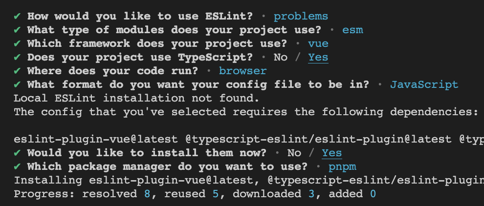

# 项目配置

## 系统环境

- node v16.14.2
- pnpm 8.0.0

## 初始化项目

全局安装 pnpm：

```shell
npm install -g pnpm
```

使用 vite 创建项目：

```shell
pnpm create vite
```

初始化项目过程中的选择：


安装项目的依赖：

```shell
pnpm install
```

## 设置自动打开浏览器

默认情况下，需要我们手动打开浏览器，运行`pnpm run dev`后自动打开浏览器，修改 package.json 中的 scripts>dev，添加--open 参数：

```javascript
  "scripts": {
    "dev": "vite --open",
    "build": "vue-tsc && vite build",
    "preview": "vite preview"
  },
```


## Eslint

插件化代码检查工具。

在开发环境依赖中安装 eslint：

```shell
pnpm install eslint -D
```

生成 eslint 的配置文件`.eslintrc.cjs`：

```shell
npx eslint --init
```

具体选择过程：




编辑生成的`.eslintrc.cjs`文件，设置相应的校验规则：

```javascript
module.exports = {
  //运行环境
  env: {
    browser: true, //浏览器端
    es2021: true, //es2021
  },
  //规则继承
  extends: [
    //全部规则默认是关闭的,这个配置项开启推荐规则,推荐规则参照文档
    //比如:函数不能重名、对象不能出现重复key
    'eslint:recommended',
    //vue3语法规则
    'plugin:vue/vue3-essential',
    //ts语法规则
    'plugin:@typescript-eslint/recommended',
  ],
  //要为特定类型的文件指定处理器
  overrides: [],
  //指定解析器:解析器
  //Esprima 默认解析器
  //Babel-ESLint babel解析器
  //@typescript-eslint/parser ts解析器
  parser: '@typescript-eslint/parser',
  //指定解析器选项
  parserOptions: {
    ecmaVersion: 'latest', //校验ECMA最新版本
    sourceType: 'module', //设置为"script"（默认），或者"module"代码在ECMAScript模块中
  },
  //ESLint支持使用第三方插件。在使用插件之前，您必须使用npm安装它
  //该eslint-plugin-前缀可以从插件名称被省略
  plugins: ['vue', '@typescript-eslint'],
  //eslint规则
  rules: {},
}
```

设置 eslint 应该忽略对哪些文件的校验，创建文件`.eslintignore`，并添加如下内容：

```javascript
node_modules
dist.vscode
public
```

package.json 新增两个运行脚本，分别用于对 src 文件夹下的文件进行 eslint 语法检测和自动进行 eslint 的语法修复:

```json
"scripts": {
    "lint": "eslint src",
    "fix": "eslint src --fix",
}
```

之后，便可以通过`pnpm run lint`去检测语法，如果出现不规范格式,通过`pnpm run fix`修改

## Prettier

格式化代码，保证代码的美观。

在 package.json 中配置

安装所需的依赖：

```javascript
pnpm install -D eslint-plugin-import eslint-plugin-vue eslint-plugin-node eslint-plugin-prettier eslint-config-prettier eslint-plugin-node @babel/eslint-parser
```

依赖说明：

```json
# 让所有与prettier规则存在冲突的Eslint rules失效，并使用prettier进行代码检查
"eslint-config-prettier": "^8.6.0",
"eslint-plugin-import": "^2.27.5",
"eslint-plugin-node": "^11.1.0",
# 运行prettier的Eslint，使prettier规则优先级更高，Eslint优先级低
"eslint-plugin-prettier": "^4.2.1",
# vue.js的Eslint插件（查找vue语法错误，发现错误指令，查找违规风格指南
"eslint-plugin-vue": "^9.9.0",
# 该解析器允许使用Eslint校验所有babel code
"@babel/eslint-parser": "^7.19.1",
```

创建 Prettier 规则配置文件`.prettier.json`:

```javascript
{
  "singleQuote": true,
  "semi": false,
  "bracketSpacing": true,
  "htmlWhitespaceSensitivity": "ignore",
  "endOfLine": "auto",
  "trailingComma": "all",
  "tabWidth": 2
}
```

配置需要忽略格式化的文件夹，创建文件`.prettierignore`并编辑内容为如下：

```text
/dist/*
/html/*
.local
/node_modules/**
**/*.svg
**/*.sh
/public/*
```

配置统一的 prettier 来格式化我们的 js 和 css，html 代码:

```javascript
 "scripts": {
    "format": "prettier --write \"./**/*.{html,vue,ts,js,json,md}\"",
    "lint:eslint": "eslint src/**/*.{ts,vue} --cache --fix",
  },
```

## stylelint

css 的 lint 工具。可格式化 css 代码，检查 css 语法错误与不合理的写法，指定 css 书写顺序等。

安装依赖：

```shell
pnpm add sass sass-loader stylelint postcss postcss-scss postcss-html stylelint-config-prettier stylelint-config-recess-order stylelint-config-recommended-scss stylelint-config-standard stylelint-config-standard-vue stylelint-scss stylelint-order stylelint-config-standard-scss -D
```

编辑 stylelint 配置文件`.stylelintrc.cjs`：

```
module.exports = {
  extends: [
    'stylelint-config-standard', // 配置stylelint拓展插件
    'stylelint-config-html/vue', // 配置 vue 中 template 样式格式化
    'stylelint-config-standard-scss', // 配置stylelint scss插件
    'stylelint-config-recommended-vue/scss', // 配置 vue 中 scss 样式格式化
    'stylelint-config-recess-order', // 配置stylelint css属性书写顺序插件,
    'stylelint-config-prettier', // 配置stylelint和prettier兼容
  ],
  overrides: [
    {
      files: ['**/*.(scss|css|vue|html)'],
      customSyntax: 'postcss-scss',
    },
    {
      files: ['**/*.(html|vue)'],
      customSyntax: 'postcss-html',
    },
  ],
  ignoreFiles: [
    '**/*.js',
    '**/*.jsx',
    '**/*.tsx',
    '**/*.ts',
    '**/*.json',
    '**/*.md',
    '**/*.yaml',
  ],
  /**
   * null  => 关闭该规则
   * always => 必须
   */
  rules: {
    'value-keyword-case': null, // 在 css 中使用 v-bind，不报错
    'no-descending-specificity': null, // 禁止在具有较高优先级的选择器后出现被其覆盖的较低优先级的选择器
    'function-url-quotes': 'always', // 要求或禁止 URL 的引号 "always(必须加上引号)"|"never(没有引号)"
    'no-empty-source': null, // 关闭禁止空源码
    'selector-class-pattern': null, // 关闭强制选择器类名的格式
    'property-no-unknown': null, // 禁止未知的属性(true 为不允许)
    'block-opening-brace-space-before': 'always', //大括号之前必须有一个空格或不能有空白符
    'value-no-vendor-prefix': null, // 关闭 属性值前缀 --webkit-box
    'property-no-vendor-prefix': null, // 关闭 属性前缀 -webkit-mask
    'selector-pseudo-class-no-unknown': [
      // 不允许未知的选择器
      true,
      {
        ignorePseudoClasses: ['global', 'v-deep', 'deep'], // 忽略属性，修改element默认样式的时候能使用到
      },
    ],
  },
}
```

配置 stylelint 的忽略文件`.stylelintignore`：

```text
/node_modules/*
/dist/*
/html/*
/public/*
```

配置 stylelint 的运行脚本`package.json`:

```javascript
"scripts": {
	"lint:style": "stylelint src/**/*.{css,scss,vue} --cache --fix"
}
```

## husky

使用协同开发时（git），强制让开发人员按照代码规范来提交代码。

利用 husky 在代码提交之前触发 git hook(git 在客户端的钩子)，然后执行`pnpm run format`来自动的格式化我们的代码。

安装`husky`:

```shell
pnpm install -D husky
```

运行`husky`:

```shell
npx husky-init
```

在根目录下生成个一个.husky 目录，在这个目录下面会有一个 pre-commit 文件，这个文件里面的命令在我们执行 commit 的时候就会执行，在`.husky/pre-commit`文件添加如下命令：

```shell
#!/usr/bin/env sh
. "$(dirname -- "$0")/_/husky.sh"
pnpm run format
```

## commitlint

利用**commitlint**来实现 commit 信息的规范和统一。

目标：必须是 git commit -m 'fix: xxx' 符合类型的才可以，**需要注意的是类型的后面需要用英文的 :，并且冒号后面是需要空一格的，这个是不能省略的**

规范：填写 git 的 commit 信息时，需要携带下列的 subject：

```java
'feat',//新特性、新功能
'fix',//修改bug
'docs',//文档修改
'style',//代码格式修改, 注意不是 css 修改
'refactor',//代码重构
'perf',//优化相关，比如提升性能、体验
'test',//测试用例修改
'chore',//其他修改, 比如改变构建流程、或者增加依赖库、工具等
'revert',//回滚到上一个版本
'build',//编译相关的修改，例如发布版本、对项目构建或者依赖的改动
```

安装`commitlint`:

```shell
pnpm add @commitlint/config-conventional @commitlint/cli -D
```

新建`commitlint.config.cjs`配置文件，添加如下内容：

```javascript
module.exports = {
  extends: ['@commitlint/config-conventional'],
  // 校验规则
  rules: {
    'type-enum': [
      2,
      'always',
      [
        'feat',
        'fix',
        'docs',
        'style',
        'refactor',
        'perf',
        'test',
        'chore',
        'revert',
        'build',
      ],
    ],
    'type-case': [0],
    'type-empty': [0],
    'scope-empty': [0],
    'scope-case': [0],
    'subject-full-stop': [0, 'never'],
    'subject-case': [0, 'never'],
    'header-max-length': [0, 'always', 72],
  },
}
```

配置 husky，添加`.husky/commit-msg`文件:

```sh
npx husky add .husky/commit-msg
```

在生成的`.husky/commit-msg`文件中，添加如下内容：

```shell
#!/usr/bin/env sh
. "$(dirname -- "$0")/_/husky.sh"
pnpm commitlint
```

在`package.json`中添加`commitlint`执行脚本：

```javascript
{
"scripts": {
    "commitlint": "commitlint --config commitlint.config.cjs -e -V"
  },
}
```

## 路径别名

## 统一包管理工具

不同包管理器工具下载同一个依赖，可能版本不一样，可能会因此出现 bug。

在根目录创建`scritps/preinstall.js`文件，添加下面的内容：

```javascript
if (!/pnpm/.test(process.env.npm_execpath || '')) {
  console.warn(
    `\u001b[33mThis repository must using pnpm as the package manager ` +
      ` for scripts to work properly.\u001b[39m\n`,
  )
  process.exit(1)
}
```

原理：在 install 的时候会触发 preinstall（npm 提供的生命周期钩子）这个文件里面的代码。

在`package.json`中添加执行脚本命令：

```javascript
"scripts": {
	"preinstall": "node ./scripts/preinstall.js"
}
```

## 参考文档

vite 官方中文文档参考：[cn.vitejs.dev/guide/](https://cn.vitejs.dev/guide/)
